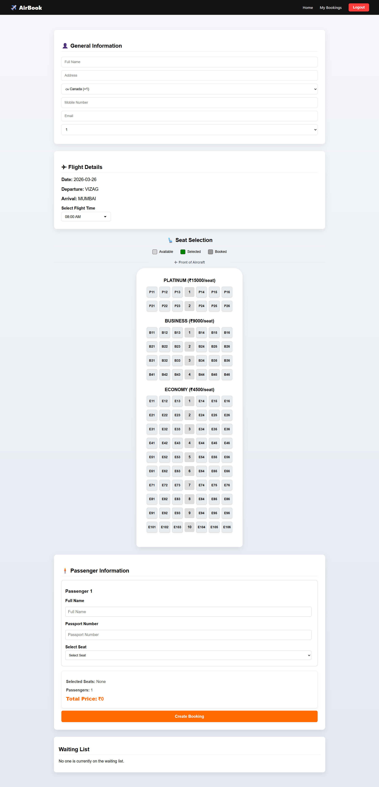
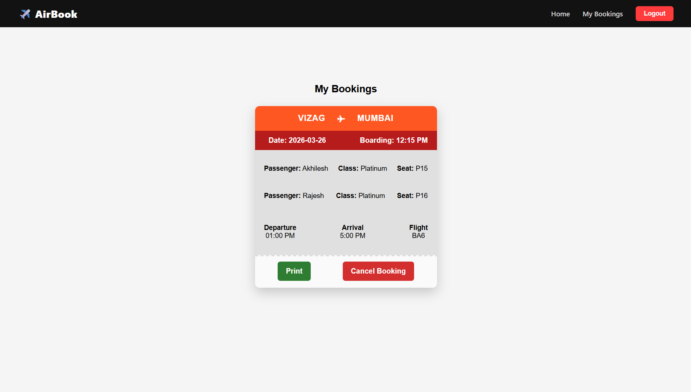

# ✈️ AirBook – Airline Reservation System


AirBook is a full-stack airline reservation platform built using the MERN stack.  
It allows users to search flights, create accounts, book tickets, and generate printable boarding passes.

The project demonstrates real-world concepts such as authentication, REST APIs, cloud deployment, and database integration.

---

## 🌐 Live Demo

🔗 https://airline-reservation-system-miuf.vercel.app

---

## 🚀 Features

* 🔍 Search flights by **departure city, destination city, and date**
* 👤 **User authentication** (Register / Login)
* 🪑 Seat class selection:

  * Economy
  * Business
  * Platinum
* 🎟️ Flight booking system
* 📄 **Printable boarding pass**
* ❌ Cancel bookings
* 📱 Responsive UI
* ☁️ Cloud deployment

---

## 🛠️ Tech Stack

### Frontend

* React.js
* React Router
* CSS3

### Backend

* Node.js
* Express.js
* JWT Authentication

### Database

* MongoDB Atlas

### Deployment

* Frontend → Vercel
* Backend → Render
* Database → MongoDB Atlas

---

## 🏗️ Architecture

```
User Browser
     ↓
Vercel (React Frontend)
     ↓
Render (Node.js API)
     ↓
MongoDB Atlas (Database)
```

---

## 📸 Screenshots

### Home Page


### Flight Search


### Booking Page



### Boarding Pass



---

## ⚙️ Installation (Local Setup)

Clone the repository:

```bash
git clone https://github.com/akhilesh2209/airline-reservation-system.git
cd airline-reservation-system
```

### Backend Setup

```
cd backend
npm install
npm start
```

### Frontend Setup

```
cd frontend
npm install
npm start
```

---

## 🎯 Future Improvements

* Payment gateway integration
* Real-time seat availability
* Flight admin dashboard
* Email booking confirmation
* Mobile responsive enhancements

---

## 👨‍💻 Author

**WUNA AKHILESH**

GitHub:
https://github.com/akhilesh2209

---

## ⭐ Support

If you found this project useful, please consider giving it a star on GitHub!
