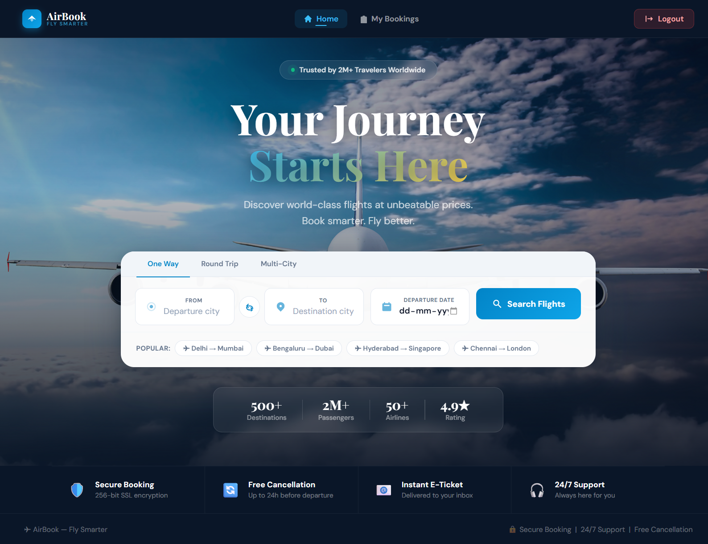
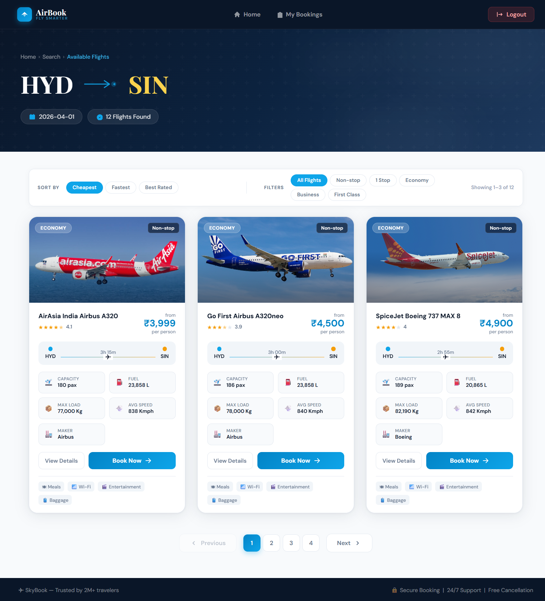
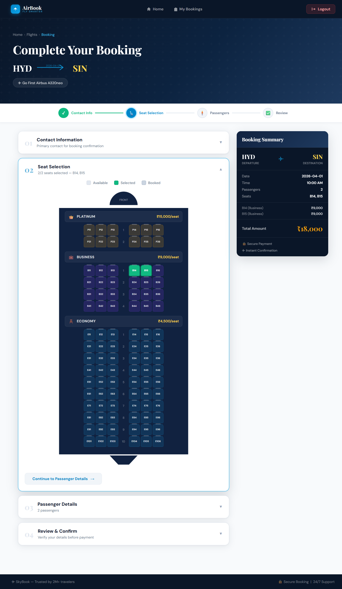
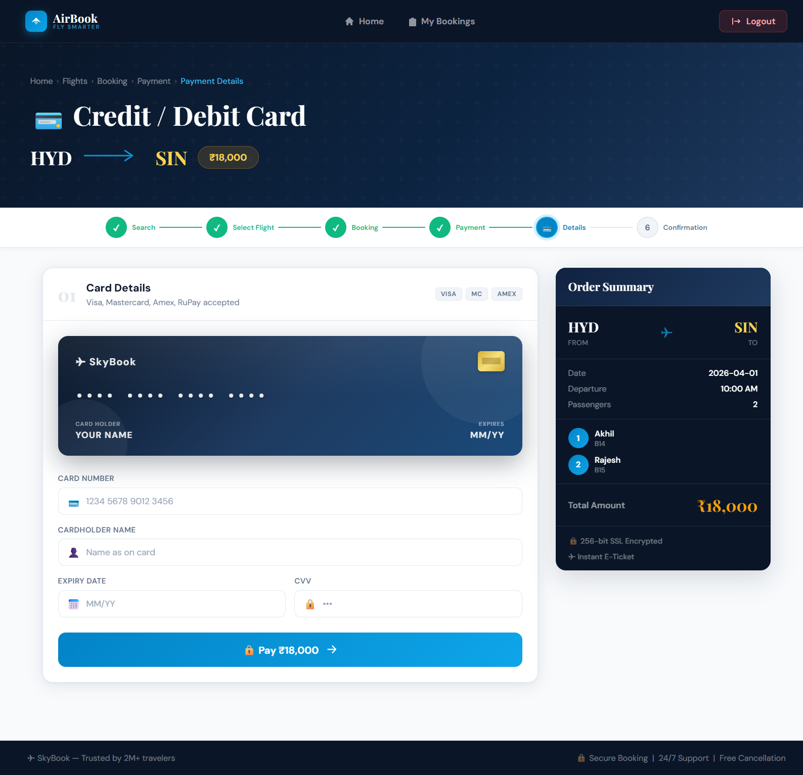
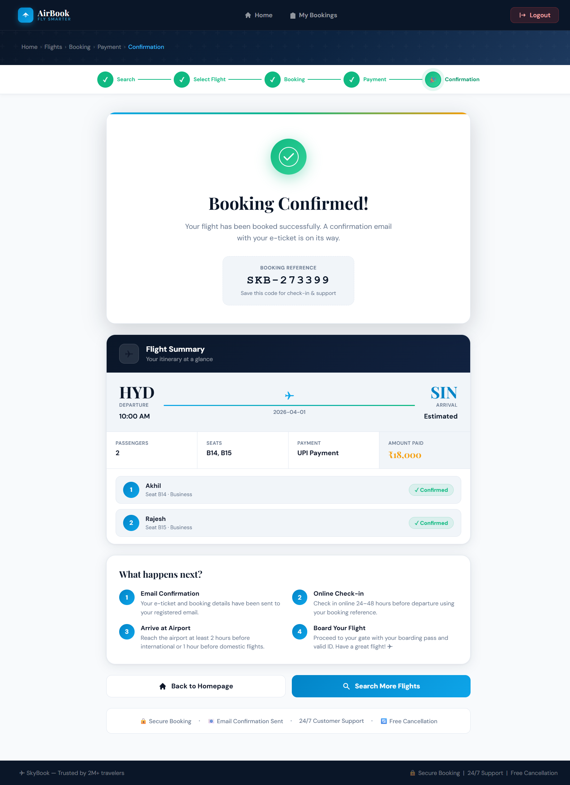
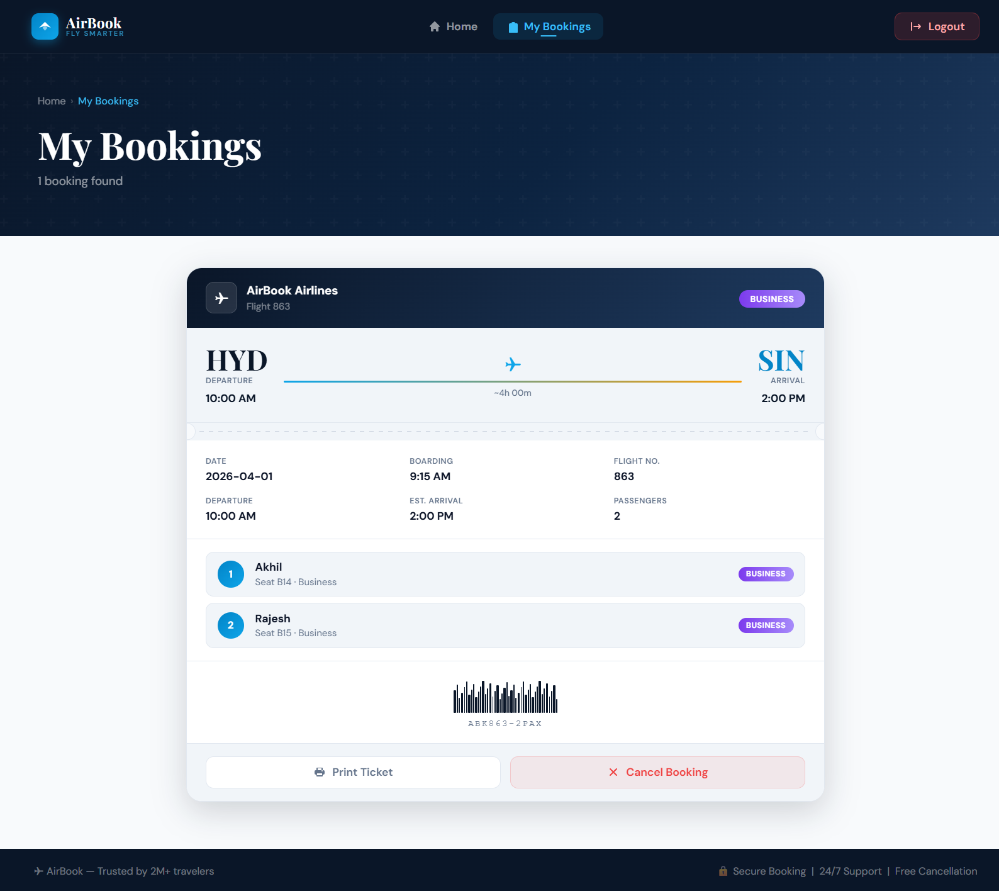
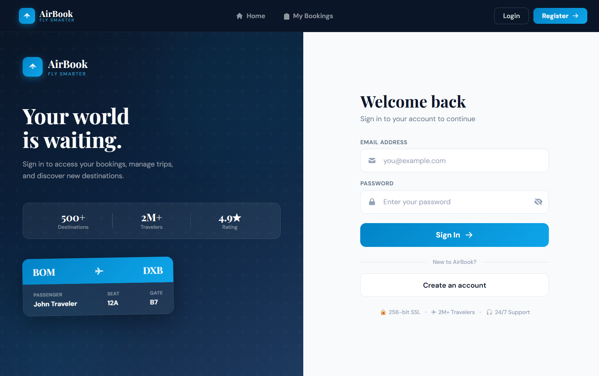
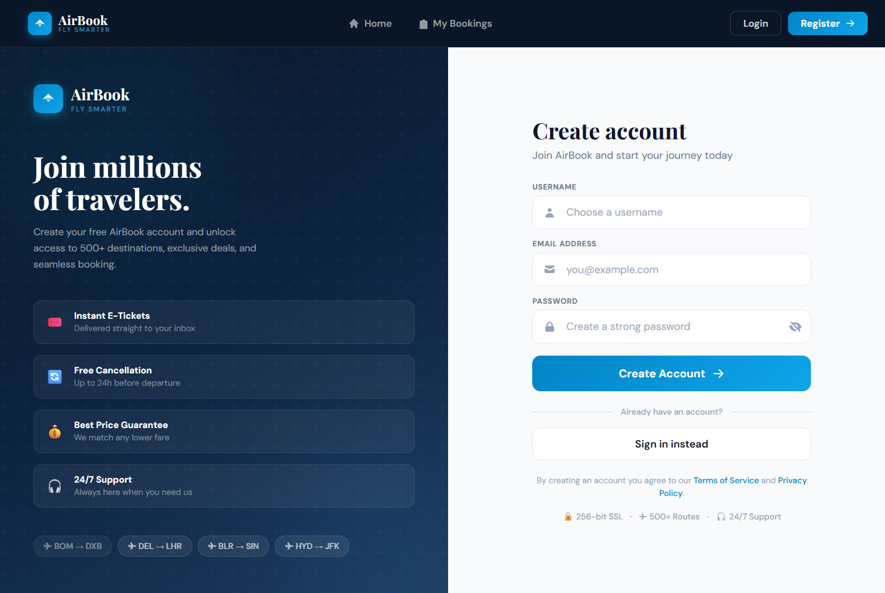

# AirBook — Airline Reservation System

<div align="center">


<br/><br/>

> **A full-stack airline reservation platform built with the MERN stack.**  
> Search flights, book seats, generate boarding passes, and manage your trips — all in one place.

<br/>

🔗 **[View Live Demo](https://airline-reservation-system-miuf.vercel.app)** &nbsp;·&nbsp;
📁 **[Browse Source Code](https://github.com/akhilesh2209/airline-reservation-system)** &nbsp;·&nbsp;
🐛 **[Report a Bug](https://github.com/akhilesh2209/airline-reservation-system/issues)**

</div>

---

## Table of Contents

- [Overview](#overview)
- [Features](#features)
- [Tech Stack](#tech-stack)
- [Architecture](#architecture)
- [Screenshots](#screenshots)
- [Getting Started](#getting-started)
- [Project Structure](#project-structure)
- [API Reference](#api-reference)
- [Future Roadmap](#future-roadmap)
- [Author](#author)

---

## Overview

AirBook is a production-ready airline reservation system that demonstrates real-world full-stack engineering. Users can register, search and browse flights, select seat classes, complete a multi-step booking flow, process payments, view downloadable boarding passes, and manage or cancel their bookings — all backed by a RESTful API and a cloud-hosted MongoDB database.

The project is designed with a clean, consistent design system across every page: dark navy headers, sky-blue accents, Playfair Display typography, and responsive layouts that work across all screen sizes.

---

## Features

| Feature | Description |
|---|---|
| 🔍 **Flight Search** | Search by departure city, destination, and travel date |
| 👤 **Authentication** | JWT-secured Register / Login / Logout flow |
| 🪑 **Seat Selection** | Visual aircraft seat map with Economy, Business, and Platinum classes |
| 🎟️ **Booking System** | Multi-step booking with passenger details and contact info |
| 💳 **Payment Flow** | Credit Card, UPI, and Bank Transfer payment methods |
| 🖨️ **Boarding Pass** | Printable boarding passes with barcode, gate, and timing details |
| 📋 **My Bookings** | View, manage, and cancel all existing bookings |
| ⏳ **Waiting List** | Join a waiting list for fully booked seats |
| 📱 **Responsive Design** | Fully responsive across desktop, tablet, and mobile |
| ☁️ **Cloud Deployed** | Frontend on Vercel, Backend on Render, DB on MongoDB Atlas |

---

## Tech Stack

### Frontend
- **React.js** — Component-based UI with hooks and React Router v6
- **React Router DOM** — Client-side routing and navigation
- **CSS3** — Custom design system with CSS variables, animations, and responsive grid
- **QRCode.react** — QR code generation for UPI payment

### Backend
- **Node.js + Express.js** — RESTful API server
- **JWT (JSON Web Tokens)** — Stateless user authentication
- **bcrypt** — Password hashing

### Database
- **MongoDB Atlas** — Cloud-hosted NoSQL database
- **Mongoose** — ODM for schema definition and queries

### Deployment
- **Vercel** — Frontend hosting with CI/CD
- **Render** — Backend API hosting
- **MongoDB Atlas** — Managed cloud database

---

## Architecture

```
┌─────────────────────────────────────────────────────────┐
│                      User Browser                        │
│              React SPA (Vercel CDN)                      │
└──────────────────────────┬──────────────────────────────┘
                           │ HTTPS / REST API
                           ▼
┌─────────────────────────────────────────────────────────┐
│              Node.js + Express API (Render)              │
│                                                         │
│   ┌─────────────┐  ┌──────────────┐  ┌──────────────┐  │
│   │  Auth Routes│  │Booking Routes│  │ Flight Routes│  │
│   │  /api/auth  │  │  /bookings   │  │  (static)    │  │
│   └─────────────┘  └──────────────┘  └──────────────┘  │
│                         │                               │
│              JWT Middleware (Protected)                  │
└──────────────────────────┬──────────────────────────────┘
                           │ Mongoose ODM
                           ▼
┌─────────────────────────────────────────────────────────┐
│               MongoDB Atlas (Cloud Database)             │
│                                                         │
│   Collections:  users  ·  bookings                      │
└─────────────────────────────────────────────────────────┘
```

### Page Flow

```
Home (Search)
    │
    └──▶ Flights List
              │
              └──▶ Booking (Seat + Passenger Details)
                        │
                        └──▶ Payment (Method Selection)
                                  │
                                  └──▶ Payment Details (Card / UPI / Bank)
                                            │
                                            └──▶ Confirmation + Boarding Pass
```

---

## 📸 Screenshots

### 🏠 Home — Flight Search


### ✈️ Flights — Available Results


### 🧾 Booking — Seat Selection & Passenger Details


### 💳 Payment — Enter Payment Details


### 🎟️ Boarding Pass


### 📋 My Bookings — Manage Trips


### 🔐 Login Page


### 📝 Register Page


---

## Getting Started

### Prerequisites

Make sure you have the following installed:

- [Node.js](https://nodejs.org/) v16 or higher
- [npm](https://npmjs.com/) v8 or higher
- A [MongoDB Atlas](https://www.mongodb.com/cloud/atlas) account and cluster

### 1. Clone the Repository

```bash
git clone https://github.com/akhilesh2209/airline-reservation-system.git
cd airline-reservation-system
```

### 2. Backend Setup

```bash
cd backend
npm install
```

Create a `.env` file in the `backend/` directory:

```env
PORT=5000
MONGO_URI=your_mongodb_atlas_connection_string
JWT_SECRET=your_jwt_secret_key
```

Start the backend server:

```bash
npm start
```

The API will be available at `http://localhost:5000`.

### 3. Frontend Setup

```bash
cd ../frontend
npm install
npm start
```

The React app will open at `http://localhost:3000`.

> **Note:** The frontend is pre-configured to call `https://airline-backend-mrkm.onrender.com` for the live API. For local development, update the fetch URLs in your components to point to `http://localhost:5000`.

---

## Project Structure

```
airline-reservation-system/
│
├── frontend/
│   ├── public/
│   └── src/
│       ├── assets/              # Images and static files
│       ├── components/
│       │   └── Navbar.js        # Global navigation
│       ├── pages/
│       │   ├── Home.js          # Flight search hero
│       │   ├── Flights.js       # Flight results listing
│       │   ├── Booking.js       # Seat selection + passenger form
│       │   ├── Payment.js       # Payment method + boarding passes
│       │   ├── PaymentDetails.js# Card / UPI / Bank details form
│       │   ├── Confirmation.js  # Booking confirmation + boarding pass
│       │   ├── MyBookings.js    # View and manage bookings
│       │   ├── Login.js         # User authentication
│       │   └── Register.js      # User registration
│       ├── App.js
│       └── index.js
│
└── backend/
    ├── models/
    │   ├── User.js              # User schema (Mongoose)
    │   └── Booking.js           # Booking schema (Mongoose)
    ├── routes/
    │   ├── auth.js              # Register / Login endpoints
    │   └── bookings.js          # CRUD booking endpoints
    ├── middleware/
    │   └── authMiddleware.js    # JWT verification
    ├── server.js
    └── .env
```

---

## API Reference

### Auth Endpoints

| Method | Endpoint | Description | Auth Required |
|---|---|---|---|
| `POST` | `/api/auth/register` | Register a new user | ❌ |
| `POST` | `/api/auth/login` | Login and receive JWT | ❌ |

### Booking Endpoints

| Method | Endpoint | Description | Auth Required |
|---|---|---|---|
| `GET` | `/bookings` | Retrieve all bookings | ✅ |
| `POST` | `/bookings` | Create a new booking | ✅ |
| `DELETE` | `/bookings/:id` | Cancel a booking by ID | ✅ |

### Request / Response Example

**POST** `/api/auth/login`

```json
// Request Body
{
  "email": "user@example.com",
  "password": "yourpassword"
}

// Response (200 OK)
{
  "token": "eyJhbGciOiJIUzI1NiIsInR5cCI6...",
  "message": "Login successful"
}
```

**POST** `/bookings`

```json
// Request Body
{
  "flight": {
    "departure": "BOM",
    "destination": "DXB",
    "date": "2025-06-15",
    "timing": "10:00 AM"
  },
  "contactDetails": {
    "name": "John Doe",
    "email": "john@example.com",
    "mobile": "9999999999",
    "countryCode": "+91",
    "address": "Mumbai, India"
  },
  "passengers": [
    { "fullName": "John Doe", "passport": "A1234567", "seat": "B11" }
  ],
  "totalAmount": 9000
}
```

---

## Future Roadmap

- [ ] **Payment Gateway** — Integrate Razorpay or Stripe for real transactions
- [ ] **Real-Time Seat Availability** — WebSocket-based live seat sync across sessions
- [ ] **Email Confirmation** — Automated booking confirmation emails via Nodemailer
- [ ] **Admin Dashboard** — Flight and booking management panel for administrators
- [ ] **Flight Status** — Live departure/arrival status integration
- [ ] **Multi-City Booking** — Support for complex itineraries with multiple legs
- [ ] **Loyalty Program** — Points-based rewards system for frequent flyers
- [ ] **Progressive Web App** — Offline support and installable mobile experience

---

## Author

<div align="center">

**WUNA AKHILESH**

Full-Stack Developer · MERN Stack · React · Node.js

[](https://github.com/akhilesh2209)

</div>

---

## Support

If you found AirBook useful or interesting, please consider giving it a ⭐ on GitHub — it helps others discover the project and motivates continued development.

<div align="center">

**[⭐ Star this repo on GitHub](https://github.com/akhilesh2209/airline-reservation-system)**

</div>

---

<div align="center">

Built with ❤️ using the MERN Stack &nbsp;·&nbsp; Deployed on Vercel + Render + MongoDB Atlas

</div>